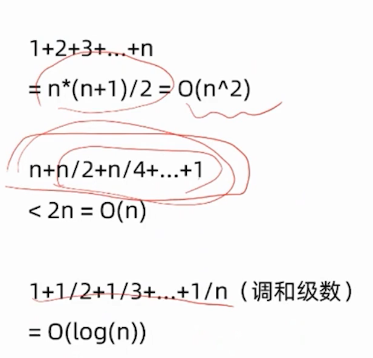
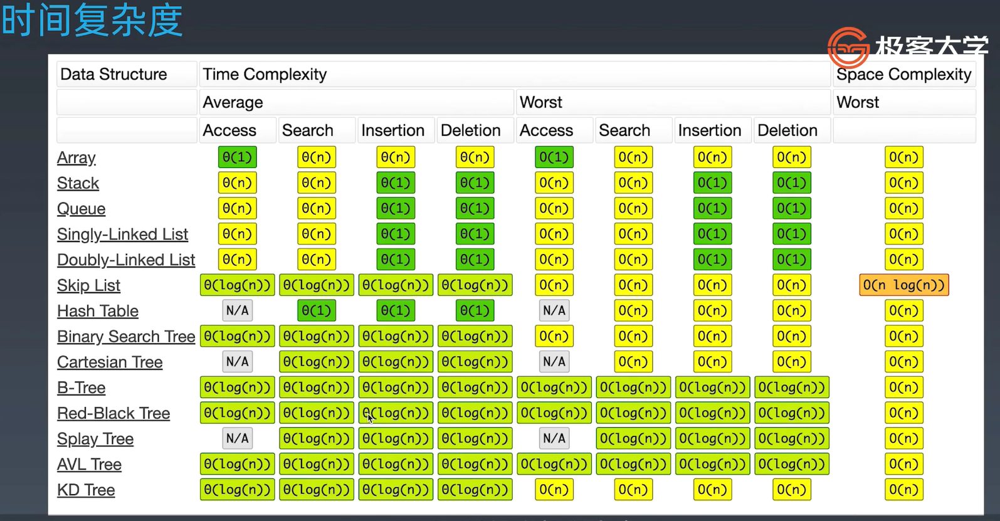

#### 方法

PPT先预习，课上不要拘泥细节，课上只听懂60-70正常，课后倍速回放。

#### 误区

不要死磕、遇题试解、不要背诵

#### 训练

多写题解

#### 时空复杂度

O(1),O(log(n)),O(n),O(n^2),O(nlog(n))O(2^n),O(n!)

#### 常见的式子

#### 时间复杂度

一般复杂度不超过千万级别，10,000,000，可以按照数据规模带入时间复杂度计算，这样可以保证1S算完。

#### 语言

语言不限制算法思想，一通百通，如果学习新语言通过算法才是最好的方式。

Java、JavaScript、Go...

#### 时间复杂度

