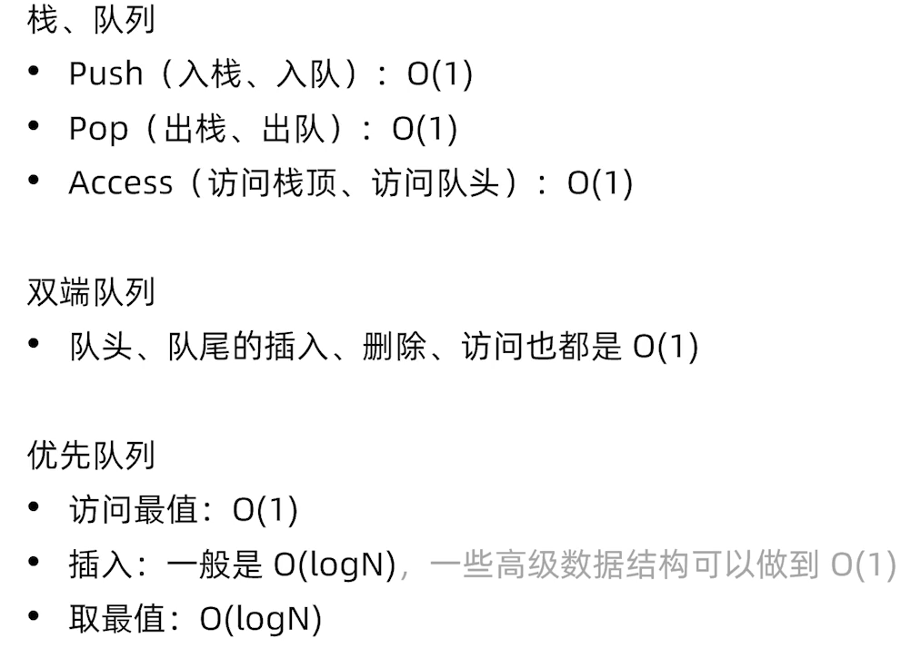

### 一、数组

#### Time

select O(1)

delete O(n)

add O(n)

末尾添加&&删除O(1)

头部添加&&删除O(n)

#### 数组原理实战

##### LC26

##### LC283

##### LC88 合并有序数组，在归并排序会用到

#### 设计变长数组

扩展一倍以及利用率不到25%收缩一半，两个阈值可以自己设定。

释放空间的阈值设定为50%，会有扰动。

扩容会导致拷贝，所以两者需要错开一些。

### 二、链表

单链表 LinkedList 只存next

双链表 double  LinkedList 存储pre和next

#### Time

Lookup O(n)

Insert O(1)

Delete O(1)

Append(push back) O(1)

Prepend(push front) O(1)

这里的插入删除是给你一个节点的，不考虑需要先查询一点的操作。

#### 链表原理实战

##### LC206

##### LC25

#### 链表应用实战

题目较难，并且不在力扣上，暂时未解（TODO）

### 三、栈&&队列

它们都是只在头尾进行操作，因此这样的容器可以用数组或则链表实现。

#### 栈原理实战

使用栈的**最近相关性**的题目特征

##### LC20

最终stack需要是空的，例如"((())"，最终会剩一个(

##### LC155

利用前缀最小值，保存最小值的历史

#### 表达式求值系列问题

前缀表达式（波兰式）

后缀表达式（逆波兰式），计算没有优先级，直接按序

##### LC150

对于运算符区分运算顺序的需要注意出栈顺序

中缀表达式

##### LC227

转换成后缀表达式计算

##### LC224

带有括号，含有正负数

#### 单调栈及其实战应用

#### 单调队列及其实战应用

