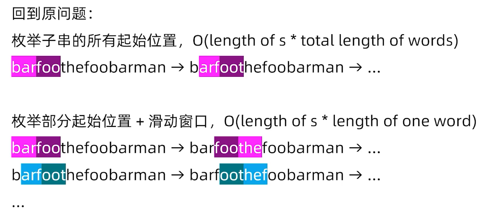

### 哈希表、无序集合、映射的实战应用(一)

##### LC1

朴素暴力出发-->枚举

hash的对象里面从后往前放置与从前往后有啥不同？

从前的话一个一个添加的元素中找是否有target-nums[i]

从后的话元素添加map，又会多一层for遍历j->nums.length-1，复杂度又-->O(n^2)


##### LC874

坐标轴与数组的index不相关

内存一般存100MB以下是比较合理的，所以本题不能够使用二维数组标记地图信息。

计算机一秒内做几千万运算到头了，现有。

用整数作为hash的时候注意，int上限20亿。


##### LC49

String和char[]转换还是需要熟练，Java API

```java
String orderStr = Arrays.toString(chars); // "[a, e, t]"
String orderStr2 = String.valueOf(chars); // "aet"
```


**1、hash尽量往语言内置的类型Integer、String上去靠（Java）**

**2、设计hash方法，也需要往语言内置类型上靠**


### 哈希表、无序集合、映射的实战应用（二）

##### LC30

串联子串与字符串删字符不一样，做的子串分割

**注重模板编程，这里模板了一个equalMap()比较两个map是否一样。**



TODO 优化题解是没有实现的，采用第一周有课程也涉及过滑动窗口


### 实现一个 LRU 缓存

1、线性表（数组、链表）

2、支持头部插入、尾部删除、中间删除、访问一个元素（是否在线性表中）


TODO 第一周的邻值查找难题就有使用

支持所有数据的数据结构，与链表建立映射关系，从这个结构的每个索引开始，指向链表的每一个节点，很快的从一个值找到一个链表节点它的位置。


##### LC146

需要结合第一周的邻值查找的思想。


### 前缀和思想及其实战应用

##### LC1248

数组求子段一共就会有O(n^2)个


##### LC53

for l、for r两层枚举时，可以通过前缀减去一层，降低时间复杂度

TODO 前缀解法理解


### 二维前缀和，差分思想及其实战应用

##### LC304


**差分和前缀和是一对互逆的运算。**

差分数组的前缀和数组就是原数组。

##### LC1109

2m次的加减操作和n次递推求和


### 双指针扫描、滑动窗口（一）

TODO 单调队列比较两个左端，去掉内存循环。


##### LC167

固定一端r发现和前缀没有啥关系。


##### LC1


##### LC15


### 双指针扫描、滑动窗口（二）

##### LC11


前四课都是线性数据结构，需要好好理解，基本面试必考。

TODO滑动窗口第一周补上

