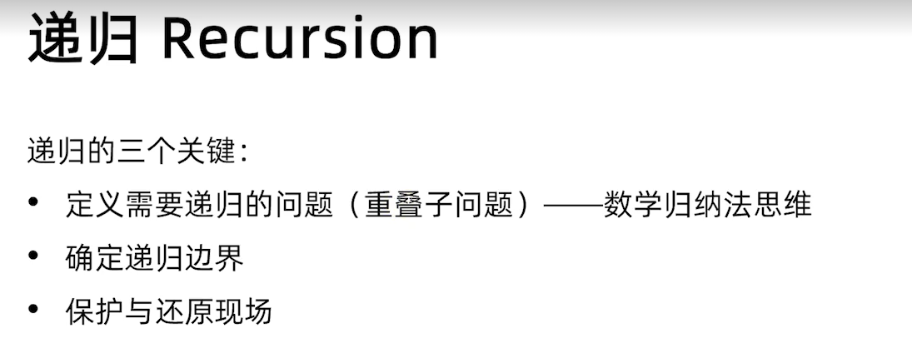
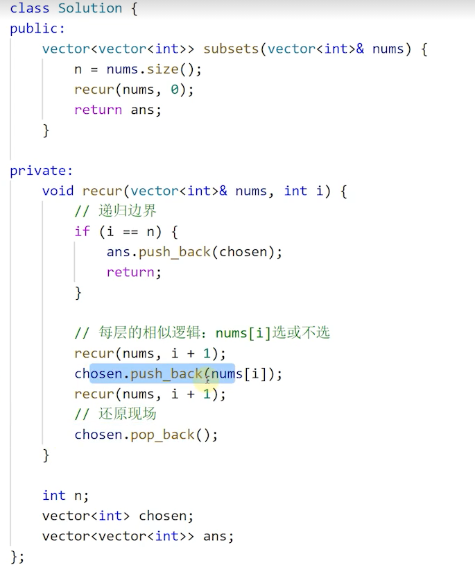
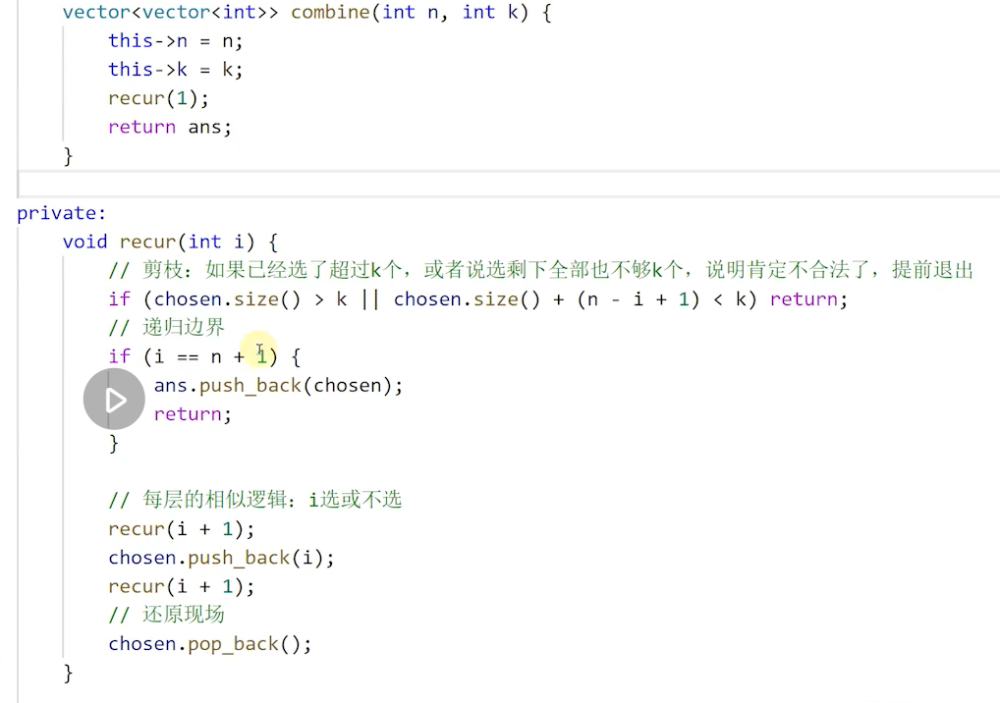
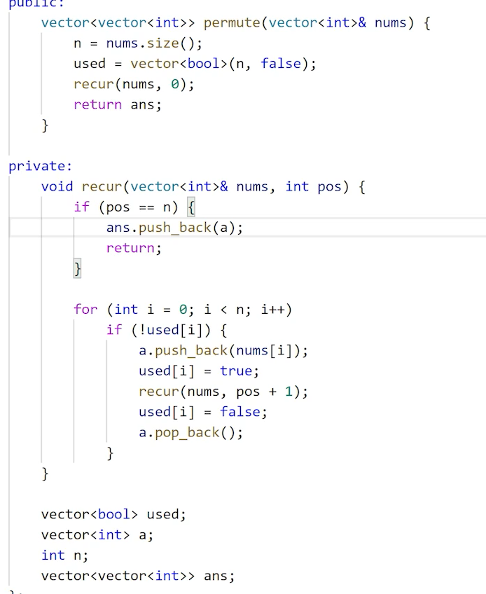
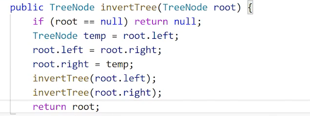
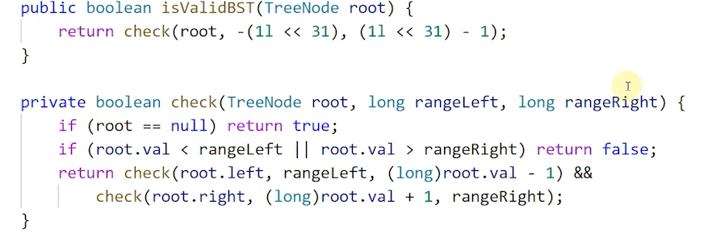
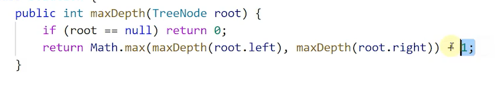
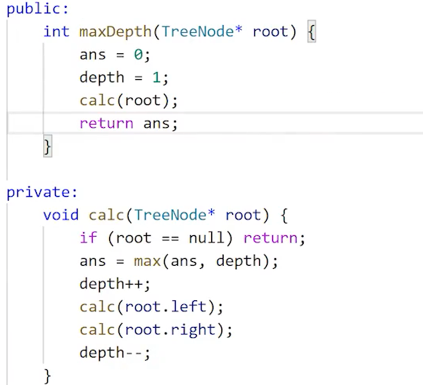
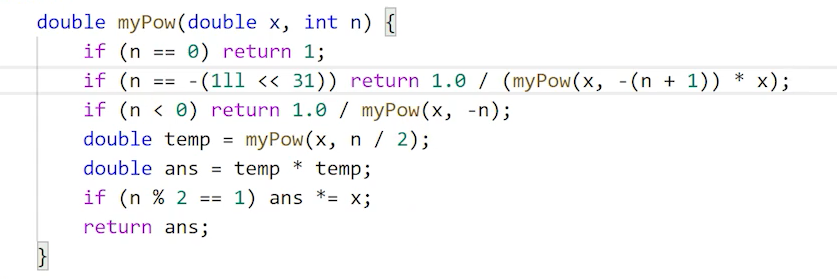
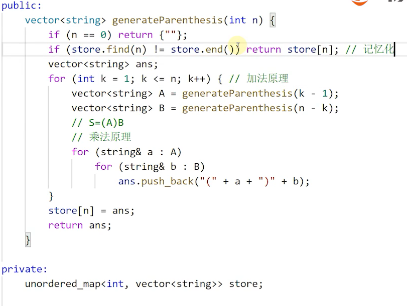

### 1、递归的本质与基本实现形式

最小子问题？TODO 前面课程同样有涉及到。

非局部变量需要考虑保护还原现场。

#### 递归的几类问题

##### LC78--子集 2^n

##### LC77--组合 2^n

int n, k;

vector chosen ans

##### LC46--全排列 n!

TODO 实战的不同语言的实现

### 2. 递归题目实战

#### 树

二叉树

递归定义

##### LC226

##### LC98

二叉搜索树的中序遍历是从小到大的。

int加减法小心整形溢出，一般来说采用long比较靠谱。

##### LC104

自底向上求值

自顶向下求值

##### LC111

递归的时候求最小深度有些不一样，左右子树任意一个为空时，不代表左右的子树就是最小值了。

### 3. 分治：子问题的划分与合并

分治是通过递归实现的，递归就需要边界。

##### LC50

分治的子问题是同一类。

如果这里使用x*x^n-1，这样就是分成了一个更小的子问题；而分治应该是分成两个三个更多的一样的子问题，分别去算这样才快。

### 4. 分治算法的应用

##### LC22

